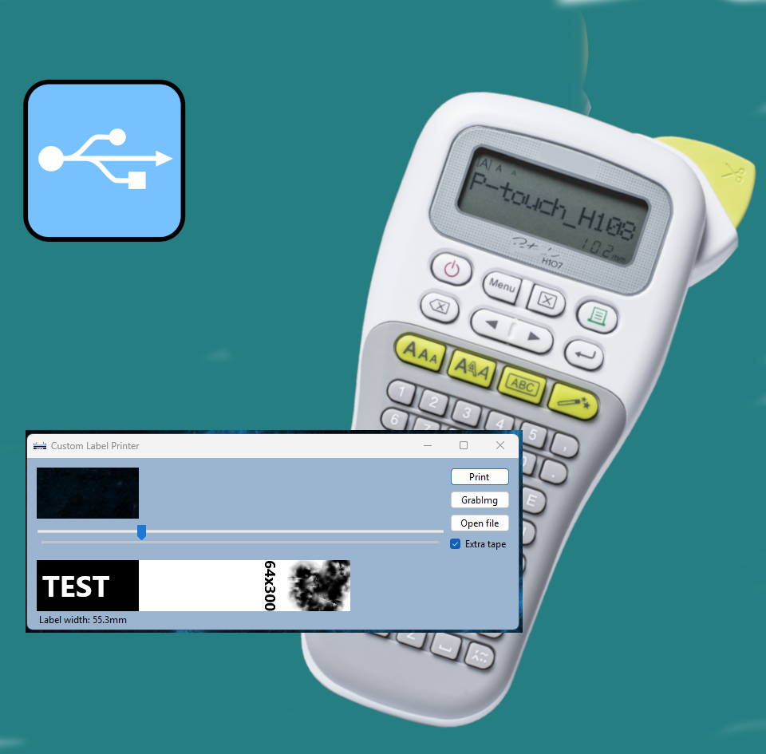
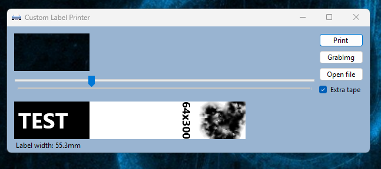
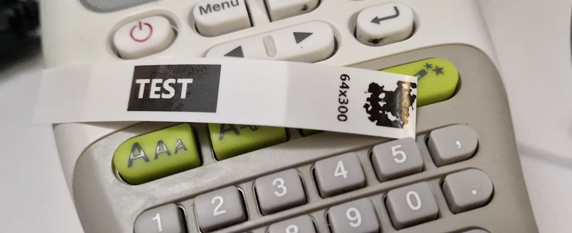
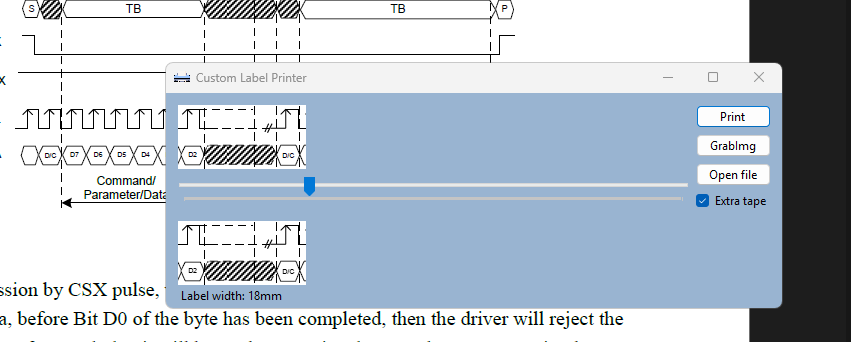
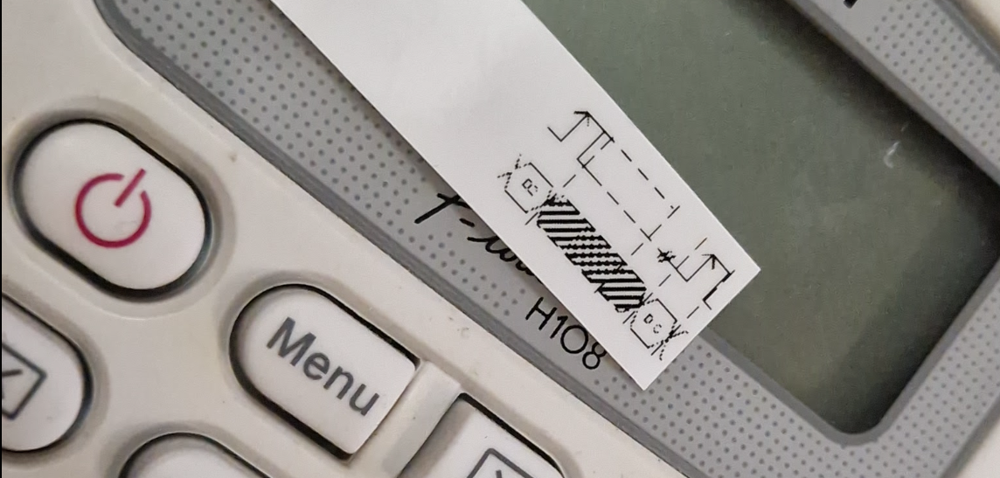
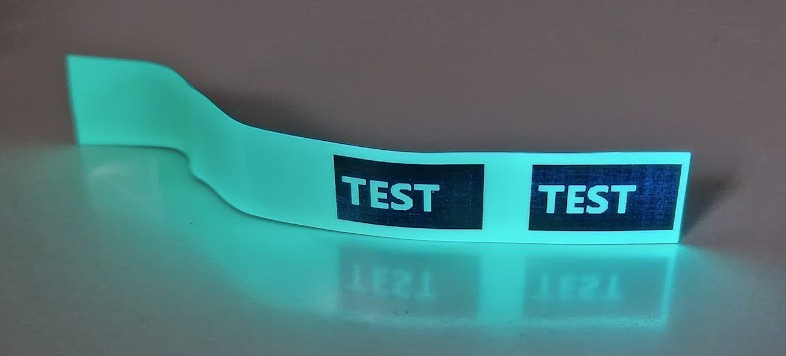

# Brother-P-Touch-H108-USB

Brother P-Touch H108 USB Upgrade Set is a project aimed at upgrading the budget label printer Brother P-Touch H108 to work with a PC via USB. This upgrade gives the printer new capabilities, including printing images and files without relying on the original electronics.

## Project Description

This project includes:
1. **Firmware for the SAMD21J18 microcontroller**, which is installed in the printer. It receives commands via USB-HID, processes them, and controls the print head and printer mechanics.
2. **PC software**, which allows:
   - Printing images from the monitor screen with a preview.
   - Printing pre-prepared files.

## Key Features

- **Microcontroller**: SAMD21J18
- **Interface**: USB-HID
- **Print Resolution**:
  - Maximum height: 64 pixels (limited by the print head).
  - Maximum width: up to 65535 pixels (virtually unlimited).
- **Software**:
  - For the microcontroller: written in C using Atmel Studio.
  - For the PC: written in C# using Visual Studio .NET 8.

## Highlights

- The original printer electronics and firmware are not used in this project.
- The Brother P-Touch H108 printer serves as a base for modification and as a source of mechanical components, such as the print head and mechanics.
- Simple interface for printing images and files.
- Supports printing with a preview.

## Project Structure

- **Microcontroller**: [SAMD21_PrinterController/SAMD21_PrinterController](SAMD21_PrinterController)
- **PC Software**: [LabelPrinter.csproj](LabelPrinter.csproj)
- **Images**: [images/](images/)

## License

This project is distributed under the [GPL](https://www.gnu.org/licenses/gpl-3.0.html) license. The license allows using, modifying, and distributing the project without restrictions, as long as the source code remains open.